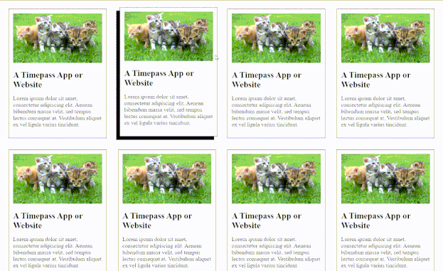

# Container Hover Animation
A simple CSS animation that adds a hover effect to container elements.

## How to use
1. Download the `styles.css` file
2. Include it in your HTML file using `<link rel="stylesheet" type="text/css" href="styles.css">`
3. Add the class `container` to the container element you want to apply the animation to.
4. Enjoy the hover effect!

## Preview

## Customization
You can customize the animation by editing the values in the CSS file. For example, you can change the direction and distance of the hover effect by editing the `translate` values in the `.container:hover` class.

## Credits
Created by [Tejas Mahajan](https://github.com/tejas242)
